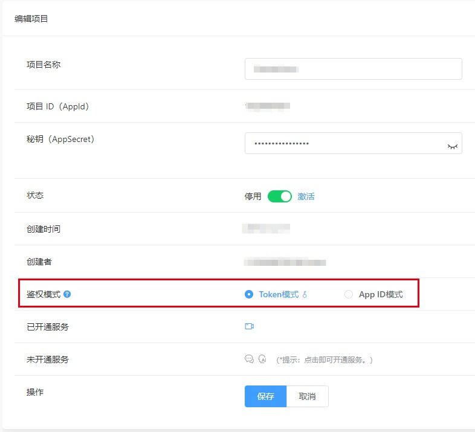
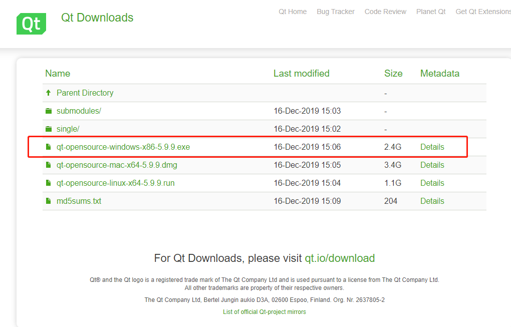
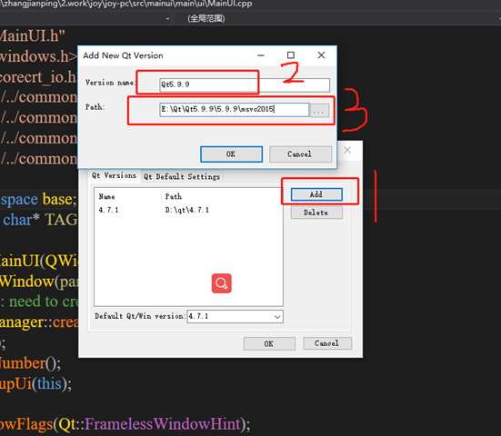
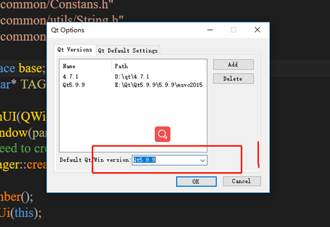
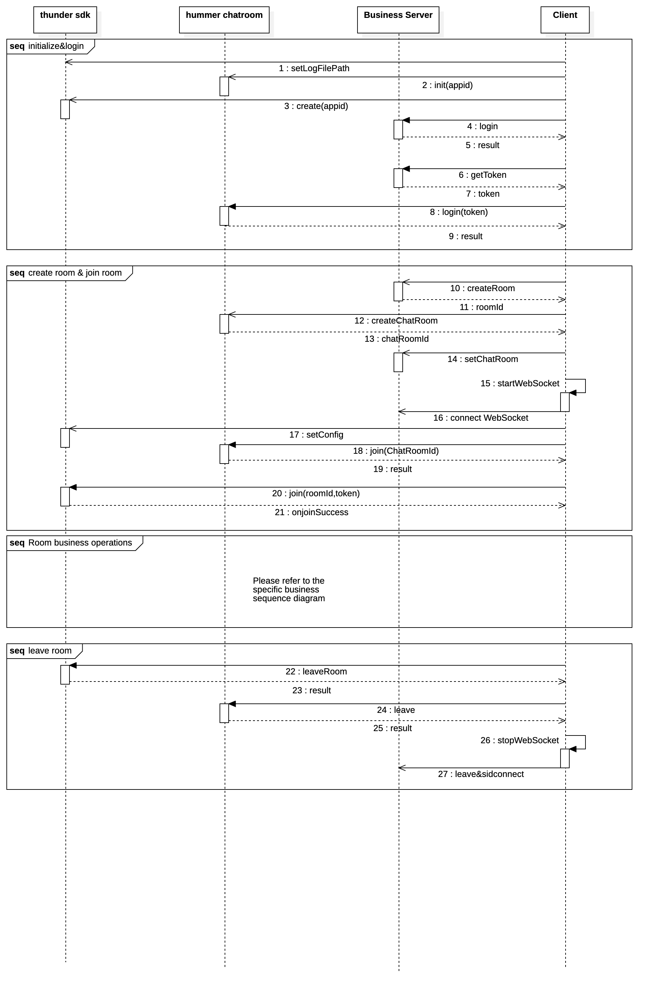
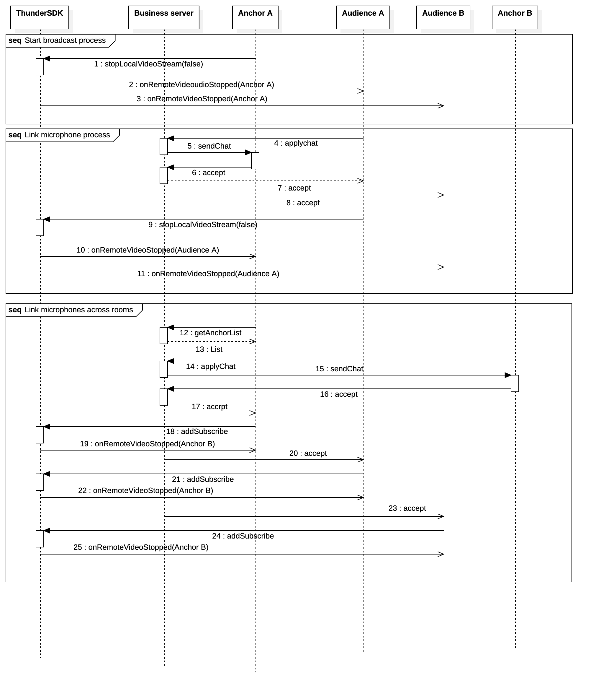

# JoyLive-PC
[中文](README.zh.md) | [English](README.md)

## 1 概览
泛娱乐包含1大模块：直播模块。
- 直播模块：可实现直播开播、多人在线观看、视频连麦等功能。禁言、多人文字聊天、视频美颜、视频滤镜、视频贴图、手势。

> 注意
> - Thunderbolt SDK：音视频的控制。[快速集成](https://docs.jocloud.com/cloud/cn/product_category/rtc_service/rt_video_interaction/integration_and_start/integration_and_start_windows.html)
> - Hummer SDK：房间类用户进出通知，以及房间类消息的传输。[快速集成](https://docs.jocloud.com/cloud/cn/product_category/rtm_service/chatroom/integration_and_start/integration_and_start_windows.html)
> - OrangeFilter SDK：美颜，五官，贴纸，手势。[快速集成](https://docs.jocloud.com/cloud/cn/product_category/beauty_sdk/integration_and_start/integration_and_start_windows.html)

## 2 快速开始
1. 去[聚联云平台](https://www.jocloud.com/cn/reg)注册账号，并创建自己的工程项目，获取到 **AppID**。
> #### 说明:
> **AppID** 模式：hummer和thunder会跳过token验证。

> **Token** 模式：适用于安全性要求较高的场景，hummer和thunder会验证token，验证过期或者不通过则无法使用服务。

> - 确保使用正确的鉴权模式 [后台配置](https://console.jocloud.com/#/manager/dashboard)。

> 
> - 确保工程路径'src\mainui\AppInfo.h'中进行配置**AppID**。
> - 如果是Token模式，一定要填写**APP_SECRET**值。如果是AppID模式，可以不填写**APP_SECRET**值。
> - 美颜功能需要申请授权码，请直接联系技术支持。

2. 本程序使用 VS2015，QT 5.9.9
下载 [QT 5.9.9](http://download.qt.io/archive/qt/5.9/5.9.9/)


下载 [Vsaddin](http://download.qt.io/archive/vsaddin/2.4.2/)


3. QT 安装完后在 VS2015 中的配置。
打开配置

QT-VS 配置

选择默认配置


4. 下载 SDK，查看上面的[快速集成](https://docs.jocloud.com/cloud/cn/product_category/rtc_service/rt_video_interaction/integration_and_start/integration_and_start_windows.html)

    相应SDK版本

    |SDK|版本|
    |:----|:----|
    |Thunder|2.9.6|
    |Hummer|1.4.0|
    |OrangeFilter|1.4.2|

5. 进入代码'src\mainui\AppInfo.h'下，配置相应值。
```c++
const QString STR_APPID = "请输入您的 APPID";
const QString STR_SECRET = "请输入您的 SECRET";
const QString STR_OF_CAMERA_NUMBER = "请输入您的美颜授权码";
```


## 3 API调用流程
####  PC 时序图


### 视频直播场景
- 视频功能-Thunderbolt主要API

|API|说明|
|:----|:----|
| [createEngine](https://docs.jocloud.com/cloud/cn/product_category/rtc_service/rt_video_interaction/api/Windows/v2.9.10/function.html#thunderenginecreateenginesceneiddelegate) | 创建 IThunderEngine 实例（一个进程只能实例化一个）|
| [destroyEngine](https://docs.jocloud.com/cloud/cn/product_category/rtc_service/rt_video_interaction/api/Windows/v2.9.10/function.html#ithunderenginedestroyengine) | 销毁 IThunderEngine 对象|
| [initialize](https://docs.jocloud.com/cloud/cn/product_category/rtc_service/rt_video_interaction/api/Windows/v2.9.10/function.html#ithunderengineinitialize) | 初始化 IThunderEngine 对象                                             |
| [setArea](https://docs.jocloud.com/cloud/cn/product_category/rtc_service/rt_video_interaction/api/Windows/v2.9.10/function.html#thunderenginesetarea) | 设置用户的国家/地区                                             |
| [setMediaMode](https://docs.jocloud.com/cloud/cn/product_category/rtc_service/rt_video_interaction/api/Windows/v2.9.10/function.html#thunderenginesetmediamode) | 配置媒体模式                                                |
| [setRoomMode](https://docs.jocloud.com/cloud/cn/product_category/rtc_service/rt_video_interaction/api/Windows/v2.9.10/function.html#thunderenginesetroommode) | 配置房间模式                                                |
| [setVideoEncoderConfig](https://docs.jocloud.com/cloud/cn/product_category/rtc_service/rt_video_interaction/api/Windows/v2.9.10/function.html#thunderenginesetvideoencoderconfig) | 配置视频开播参数                                            |
| [joinRoom](https://docs.jocloud.com/cloud/cn/product_category/rtc_service/rt_video_interaction/api/Windows/v2.9.10/function.html#thunderenginejoinroomroomnameuid) | 加入房间，此接口是异步接口，需要监控ThunderEventHandler中[onJoinRoomSuccess](https://docs.jocloud.com/cloud/cn/product_category/rtc_service/rt_video_interaction/api/Windows/v2.9.10/notification.html#ithundereventhandleronjoinroomsuccess)。 |
| [stopLocalAudioStream](https://docs.jocloud.com/cloud/cn/product_category/rtc_service/rt_video_interaction/api/Windows/v2.9.10/function.html#thunderenginestoplocalaudiostream) | 音频推流开关（闭麦功能）                                |
| [startVideoPreview](https://docs.jocloud.com/cloud/cn/product_category/rtc_service/rt_video_interaction/api/Windows/v2.9.10/function.html#thunderenginestartvideopreview) | 本地视频预览开关                                        |
| [stopLocalVideoStream](https://docs.jocloud.com/cloud/cn/product_category/rtc_service/rt_video_interaction/api/Windows/v2.9.10/function.html#thunderenginestoplocalvideostream) | 视频推流开关                                            |
| [setLocalVideoCanvas](https://docs.jocloud.com/cloud/cn/product_category/rtc_service/rt_video_interaction/api/Windows/v2.9.10/function.html#thunderenginesetlocalvideocanvas) | 设置本地视图，设置此窗口，则可以看到我的视频画面        |
| [setRemoteVideoCanvas](https://docs.jocloud.com/cloud/cn/product_category/rtc_service/rt_video_interaction/api/Windows/v2.9.10/function.html#thunderenginesetremotevideocanvas) | 设置远端视频的渲染视图，设置此窗口，则可以看到远端订阅的对应uid的流的画面 |
| [addSubscribe](https://docs.jocloud.com/cloud/cn/product_category/rtc_service/rt_video_interaction/api/Windows/v2.9.10/function.html#thunderengineaddsubscribeuid) | 跨房间订阅（主播PK功能）                             |
| [removeSubscribe](https://docs.jocloud.com/cloud/cn/product_category/rtc_service/rt_video_interaction/api/Windows/v2.9.10/function.html#thunderengineremovesubscribeuid) | 取消跨房间订阅                                          |
| [setInputtingMute](https://docs.jocloud.com/cloud/cn/product_category/rtc_service/rt_video_interaction/api/Windows/v2.9.10/function.html#thunderengineremovesubscribeuid) | 静音当前音频输入设备。                                          |
| [startVideoDeviceCapture](https://docs.jocloud.com/cloud/cn/product_category/rtc_service/rt_video_interaction/api/Windows/v2.9.10/function.html#thunderengineremovesubscribeuid) | 打开视频输入设备并启动采集。                                          |
| [setInputtingDevice](https://docs.jocloud.com/cloud/cn/product_category/rtc_service/rt_video_interaction/api/Windows/v2.9.10/function.html#thunderengineremovesubscribeuid) | 设置音频输入设备。                                          |
| [stopVideoPreview](https://docs.jocloud.com/cloud/cn/product_category/rtc_service/rt_video_interaction/api/Windows/v2.9.10/function.html#thunderengineremovesubscribeuid) | 停止摄像头视频预览。                                          |
| [stopVideoDeviceCapture](https://docs.jocloud.com/cloud/cn/product_category/rtc_service/rt_video_interaction/api/Windows/v2.9.10/function.html#thunderengineremovesubscribeuid) | 停止视频设备的采集。                                          |
| [enumVideoDevices](https://docs.jocloud.com/cloud/cn/product_category/rtc_service/rt_video_interaction/api/Windows/v2.9.10/function.html#thunderengineremovesubscribeuid) | 枚举视频输入设备。                                          |
| [enumInputDevices](https://docs.jocloud.com/cloud/cn/product_category/rtc_service/rt_video_interaction/api/Windows/v2.9.10/function.html#thunderengineremovesubscribeuid) | 枚举音频输入设备。                                          |
| [setLocalVideoMirrorMode](https://docs.jocloud.com/cloud/cn/product_category/rtc_service/rt_video_interaction/api/Windows/v2.9.10/function.html#thunderenginesetlocalvideomirrormode) | 设置本地视频镜像模式 |
| [leaveRoom](https://docs.jocloud.com/cloud/cn/product_category/rtc_service/rt_video_interaction/api/Windows/v2.9.10/function.html#thunderengineleaveroom) | 离开房间，此接口是异步接口，需要监控ThunderEventHandler中[onLeaveRoom](https://docs.jocloud.com/cloud/cn/product_category/rtc_service/rt_video_interaction/api/Windows/v2.9.10/notification.html#ithundereventhandleronleaveroom)。 |

#### 时序图 -- PC + 连麦


## 4 美颜接入
- 美颜需要授权码校验，请直接查看授权代码
```c++
/*
 * serialNumber 授权码
 * licensePath 本地文件夹路径，保存授权码的本地备份，如果没有of_offline_license.licence 文件会在本地生成该文件
 * resDir 特效包的本地文件夹路径，此路径下有 effects 文件夹，所有特效包，模型包都放在 effects 文件夹内。
 */
bool createContext(const std::string& serialNumber,const std::string& licensePath, const std::string& resDir, VenusType aiType = VN_All);
```
- 如果没有 Opengl 渲染环境，可以直接使用 **src\mainui\sdk\beautyBeautyManager.h**中封装的接口。在添加视频数据和修改美颜特效上，都使用线程同步实现，具体实现方法可以直接查看代码。
- 如果有 Opengl 环境，可以使用 OrangeHelper.h 中的接口，帧处理，修改美颜特效和删除OrangeHelper 实例都要在 Opengl 的渲染线程，具体请参照代码。

## 5 FAQ
#### Q：为什么看不到对方视频？
- 检查AppID是否正确。
- 检查 startVideoPreview 和 stopLocalVideoStream 的值是否设置正确。
- 检查 setRemoteVideoCanvas 是否设置，并且对方uid是否正确。
- 检查两边房间号，如果是跨房间订阅（不同房间号），需要使用 addSubscribe，并且正确的设置对方uid。

#### Q：为什么听不到对方声音？
- 检查AppID是否正确。
- 确保已正确设置 stopLocalAudioStream 的参数stop。
- 检查自己手机是否为静音模式。
- 检查双方是否已成功加入同一个房间（joinRoom）。

#### Q：为什么加入房间（joinRoom）失败？
- 检查AppID是否正确。
- 检查 joinRoom 返回的[错误码](https://docs.jocloud.com/cloud/cn/product_category/rtc_service/rt_video_interaction/api/Windows/v2.9.10/code.html)，查看具体原因。

#### Q: 为什么自己看不到预览？
- 检查是否有 onJoinRoomSuccess 返回。
- 检查是否在 onJoinRoomSuccess 后调用 startVideoPreview。
- 检查是否使用 setLocalVideoCanvas 设置本地视图，setRemoteVideoCanvas 是不能设置本地视图的

#### Q：怎么动态设置Canvas的尺寸大小？
- onVideoSizeChanged，此回调只有在本地或者对方调用 stopLocalVideoStream 参数是 false 的时候才有此回调，可以根据此回调，进行动态设置 canvas 的尺寸大小。

#### Q：为什么美颜会失败？
- 检查授权码是否正确，是否已经过期。
- 检查 createContext 接口 resDir 路径是否传入正确。
- 检查路径下是否有 effects 文件夹，并且文件夹内有模型包和特效包。
- 检查视频数据格式，现在只支持 RGBA 和 BGRA 两种格式。

#### Q：为什么贴纸和手势失效？
- 检查授权码是否正确，是否已经过期。
- 检查 createContext 接口 resDir 路径是否传入正确。
- 检查路径下是否有 effects 文件夹，并且文件夹内有模型包和特效包。
- 检查贴纸和手势的特效包是否是当前授权码的，特效包和授权码是一一绑定的。
- 检查贴纸是否路径是否正确。

## 6 联系我们
- 完整的 API 文档见[开发者中心](https://docs.jocloud.com/cn)。
- 相关Demo下载，请访问：[SDK及Demo下载](https://docs.jocloud.com/download)。
- 如果有售前咨询问题, 可以拨打电话:020-82120482 或 联系邮箱:marketing@jocloud.com。