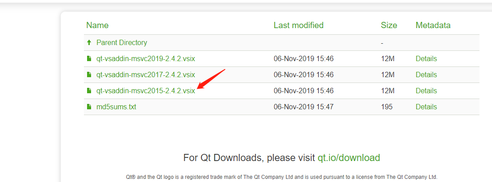
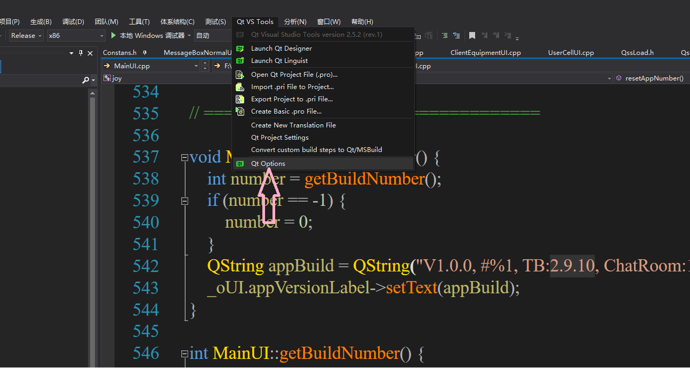

# JoyLive-PC
Solutions for Pan-Entertainment Scenarios [中文](./README_zh.md)

# Overview 
Pan-Entertainment includes one big module: live broadcast module.
- Live broadcast module: it can realize the functions of live broadcast, multi person online viewing, video connection and so on. Forbidden words, multi person text chat, video beauty, video filter, video map, gesture.

> Note：
>
> - Thunderbolt SDK: Control of audio and video. [Quick Integration](https://docs.aivacom.com/cloud/en/product_category/rtc_service/rt_video_interaction/integration_and_start/integration_and_start_ios.html).
> - Hummer SDK: The notification of user entering/exiting a room and the transmission of room messages. [Quick Integration](https://docs.aivacom.com/cloud/en/product_category/rtm_service/chatroom/integration_and_start/integration_and_start_ios.html).
> - OrangeFilter SDK: Beauty, facial features, stickers, gestures. [Quick Integration](https://docs.jocloud.com/cloud/en/product_category/beauty_sdk/integration_and_start/integration_and_start_windows.html).

# Integrated SDK
1. Go to [Jocloud](https://www.jocloud.com/en/reg) to register an account and create your own project to get the AppID.
> Note:
>
> **App ID** mode: Hummer and Thunder SDK will skip the token verification, which is applicable to situations with low security requirements.
>
> **Token** mode: Hummer and Thunder SDK will verify the token and the APP_SECRET is required. If the authentication expires or fails, the service is invalid. This mode is applicable to situations with high security requirements.
> - You can configure the AppID/Token mode in [Console](https://console.aivacom.com/#/manager/dashboard).
> 
> - Please ensure that Appid is configured in the project path 'MouseLive/Common/SYAppInfo.m'.
> - If it is Token mode, be sure to fill in the **APP_SECRET** value. If it is AppId mode, you can not fill in the **APP_SECRET** value.
> - The beauty function requires an authorization code, please contact technical support directly。

2. This program uses VS2015，QT 5.9.9
Download address: [QT 5.9.9](http://download.qt.io/archive/qt/5.9/5.9.9/)


Download address: [Vsaddin](http://download.qt.io/archive/vsaddin/2.4.2/)


3. QT configuration in VS2015 after installation
Open configuration

QT-VS configuration

Choose the default configuration


4. Download the SDK, check the above[Quick Integration](https://docs.jocloud.com/cloud/en/product_category/beauty_sdk/integration_and_start/integration_and_start_windows.html)

    相应SDK版本

    |SDK|版本|
    |:----|:----|
    |Thunder|2.9.6|
    |Hummer|1.4.0|
    |OrangeFilter|1.4.2|


5. Set the code 'MouseLive/Common/SYAppInfo.m' with corresponding values.
```c++
const QString STR_APPID = "请输入您的 APPID";
const QString STR_SECRET = "请输入您的 SECRET";
const QString STR_OF_CAMERA_NUMBER = "请输入您的美颜授权码";
```

# API Calling Flow
#### Thunderbolt Sequence Diagram


### Video Live Streaming
- Main APIs

|API|Description|
|:----|:----|
| [createEngine](https://docs.jocloud.com/cloud/cn/product_category/rtc_service/rt_video_interaction/api/Windows/v2.9.10/function.html#thunderenginecreateenginesceneiddelegate) | Create the Thunder:: IThunderEngine instance. Currently, the SDK only supports one IThunderEngine instance, meaning that each application can only create one IThunderEngine object.|
| [destroyEngine](https://docs.jocloud.com/cloud/cn/product_category/rtc_service/rt_video_interaction/api/Windows/v2.9.10/function.html#ithunderenginedestroyengine) | Destroy the Thunder::IThunderEngine instance. |
| [initialize](https://docs.jocloud.com/cloud/cn/product_category/rtc_service/rt_video_interaction/api/Windows/v2.9.10/function.html#ithunderengineinitialize) | Initialize the engine.                                             |
| [setArea](https://docs.jocloud.com/cloud/cn/product_category/rtc_service/rt_video_interaction/api/Windows/v2.9.10/function.html#thunderenginesetarea) | Set a user's country/region.                                             |
| [setMediaMode](https://docs.jocloud.com/cloud/cn/product_category/rtc_service/rt_video_interaction/api/Windows/v2.9.10/function.html#thunderenginesetmediamode) | 配置媒体模式                                                |
| [setRoomMode](https://docs.jocloud.com/cloud/cn/product_category/rtc_service/rt_video_interaction/api/Windows/v2.9.10/function.html#thunderenginesetroommode) | Set room mode.                                                |
| [setVideoEncoderConfig](https://docs.jocloud.com/cloud/cn/product_category/rtc_service/rt_video_interaction/api/Windows/v2.9.10/function.html#thunderenginesetvideoencoderconfig) |Set video encoding configuration                                            |
| [joinRoom](https://docs.jocloud.com/cloud/cn/product_category/rtc_service/rt_video_interaction/api/Windows/v2.9.10/function.html#thunderenginejoinroomroomnameuid) | Join a room.Successful function return only indicates that the request has executed successfully. Successful joining of a room is indicated by the callback[onJoinRoomSuccess](https://docs.jocloud.com/cloud/cn/product_category/rtc_service/rt_video_interaction/api/Windows/v2.9.10/notification.html#ithundereventhandleronjoinroomsuccess)。 |
| [stopLocalAudioStream](https://docs.jocloud.com/cloud/cn/product_category/rtc_service/rt_video_interaction/api/Windows/v2.9.10/function.html#thunderenginestoplocalaudiostream) | Stop/start audio publishing (including enabling capture, encoding and stream pushing).                                |
| [startVideoPreview](https://docs.jocloud.com/cloud/cn/product_category/rtc_service/rt_video_interaction/api/Windows/v2.9.10/function.html#thunderenginestartvideopreview) | Enable camera video preview.                                        |
| [stopLocalVideoStream](https://docs.jocloud.com/cloud/cn/product_category/rtc_service/rt_video_interaction/api/Windows/v2.9.10/function.html#thunderenginestoplocalvideostream) | Enable/disable local video transmission.                                            |
| [setLocalVideoCanvas](https://docs.jocloud.com/cloud/cn/product_category/rtc_service/rt_video_interaction/api/Windows/v2.9.10/function.html#thunderenginesetlocalvideocanvas) | Set the rendering view of local videos.        |
| [setRemoteVideoCanvas](https://docs.jocloud.com/cloud/cn/product_category/rtc_service/rt_video_interaction/api/Windows/v2.9.10/function.html#thunderenginesetremotevideocanvas) | Set remote video rendering. |
| [addSubscribe](https://docs.jocloud.com/cloud/cn/product_category/rtc_service/rt_video_interaction/api/Windows/v2.9.10/function.html#thunderengineaddsubscribeuid) | Subscribe to specific streams (cross-room).                             |
| [removeSubscribe](https://docs.jocloud.com/cloud/cn/product_category/rtc_service/rt_video_interaction/api/Windows/v2.9.10/function.html#thunderengineremovesubscribeuid) | Unsubscribe specified streams.                                          |
| [setInputtingMute](https://docs.jocloud.com/cloud/cn/product_category/rtc_service/rt_video_interaction/api/Windows/v2.9.10/function.html#thunderengineremovesubscribeuid) | Mute the current audio input device.                                          |
| [startVideoDeviceCapture](https://docs.jocloud.com/cloud/cn/product_category/rtc_service/rt_video_interaction/api/Windows/v2.9.10/function.html#thunderengineremovesubscribeuid) | Enable video input device and capture.                                          |
| [setInputtingDevice](https://docs.jocloud.com/cloud/cn/product_category/rtc_service/rt_video_interaction/api/Windows/v2.9.10/function.html#thunderengineremovesubscribeuid) | Set audio input devices.                                          |
| [stopVideoPreview](https://docs.jocloud.com/cloud/cn/product_category/rtc_service/rt_video_interaction/api/Windows/v2.9.10/function.html#thunderengineremovesubscribeuid) | Disable camera video preview.                                          |
| [stopVideoDeviceCapture](https://docs.jocloud.com/cloud/cn/product_category/rtc_service/rt_video_interaction/api/Windows/v2.9.10/function.html#thunderengineremovesubscribeuid) | Disable video device capture.                                          |
| [enumVideoDevices](https://docs.jocloud.com/cloud/cn/product_category/rtc_service/rt_video_interaction/api/Windows/v2.9.10/function.html#thunderengineremovesubscribeuid) | Enumerate video input devices.                                          |
| [enumInputDevices](https://docs.jocloud.com/cloud/cn/product_category/rtc_service/rt_video_interaction/api/Windows/v2.9.10/function.html#thunderengineremovesubscribeuid) | Enumerate audio input devices.                                          |
| [setLocalVideoMirrorMode](https://docs.jocloud.com/cloud/cn/product_category/rtc_service/rt_video_interaction/api/Windows/v2.9.10/function.html#thunderenginesetlocalvideomirrormode) | Set local video mirror mode. |
| [leaveRoom](https://docs.jocloud.com/cloud/cn/product_category/rtc_service/rt_video_interaction/api/Windows/v2.9.10/function.html#thunderengineleaveroom) | Exit a room to end a call.Once joinRoom is called, you have to call leaveRoom to end the call before joining another one. Whether you are in a call or not, leaveRoom can be called to end the call and release all related resources.[onLeaveRoom](https://docs.jocloud.com/cloud/en/product_category/rtc_service/rt_video_interaction/api/Windows/v2.9.10/notification.html#ithundereventhandleronleaveroom)。will callback. |

#### Sequence Diagram


## 美颜接入
- Beautification requires authorization code verification, please check the authorization code directly.
```c++
/*
 * serialNumber Authorization code
 * licensePath Local folder path, save the local backup of the authorization code, if there is no of_offline_license.licence file, the file will be generated locally.
 * resDir The local folder path of the special effect package. There is the effects folder under this path. All special effect packages and model packages are placed in the effects folder.
 */
bool createContext(const std::string& serialNumber,const std::string& licensePath, const std::string& resDir, VenusType aiType = VN_All);
```
- If there is no Opengl rendering environment, you can directly use the interface encapsulated in **src\mainui\sdk\beautyBeautyManager.h**. In adding video data and modifying beauty special effects, thread synchronization is used to implement, and the specific implementation method can be directly viewed in the code.
- If you have an Opengl environment, you can use the interface in OrangeHelper.h. Frame processing, modification of beauty effects, and deletion of OrangeHelper instances must all be in the Opengl rendering thread. Please refer to the code for details.

# FAQ
### Q: Why can't I see other's video?
- Check if the AppID is correct.
- Check if the startVideoPreview and stopLocalVideoStream are correctly set.
- Check if setRemoteVideoCanvas is set and the other's uid is correct.
- Check the room number on both sides. If you subscribe across rooms (different room numbers), you need to use addSubscribe and set the uid of the other party correctly.

### Q: Why can't I hear the other's voice?
- Check if the AppID is correct.
- Check if the parameter "stop" of stopLocalAudioStream is correctly set.
- Check if other's mobile phone is mute.
- Check if the both sides have joined the same room.

### Q: Why can’t I join the room (joinRoom)?
- Check if the AppID is correct.
- Check the [error code](https://docs.aivacom.com/cloud/en/product_category/rtc_service/rt_audio_interaction/api/iOS/v2.8.0/code.html) returned by joinRoom to see the cause.

#### Q: Why can't I see the preview？
- Check if there is onJoinRoomSuccess returned.
- Check if startVideoPreview is called after onJoinRoomSuccess.
- Check if you use setLocalVideoCanvas to set the local view, setRemoteVideoCanvas cannot set the local view

#### Q：How to dynamically set the size of Canvas？
- onVideoSizeChanged, This callback only has this callback when the stopLocalVideoStream parameter is false when the local or the other party calls stopLocalVideoStream. The size of the canvas can be dynamically set based on this callback.

#### Q：Why does beauty fail？
- Check whether the authorization code is correct and whether it has expired.
- Check whether the resDir path of the createContext interface is passed in correctly.
- Check if there is an effects folder in the path, and there are model packages and special effects packages in the folder.
- Check the video data format, now only supports RGBA and BGRA two formats.

#### Q：Why stickers and gestures don’t work？
- Check whether the authorization code is correct and whether it has expired.
- Check whether the resDir path of the createContext interface is passed in correctly.
- Check if there is an effects folder in the path, and there are model packages and special effects packages in the folder.
- Check whether the special effect package of stickers and gestures is the current authorization code, and the special effect package and authorization code are bound one by one.
- Check if the path of the sticker is correct.

## Contact us
- For complete API documentation, please see [Developer Center](https://docs.jocloud.com/cn).
- For related Demo download, please visit: [SDK and Demo Download](https://docs.jocloud.com/download).
- If you have questions about pre-sale consultation, you can call: 020-82120482 or contact email: marketing@jocloud.com.
