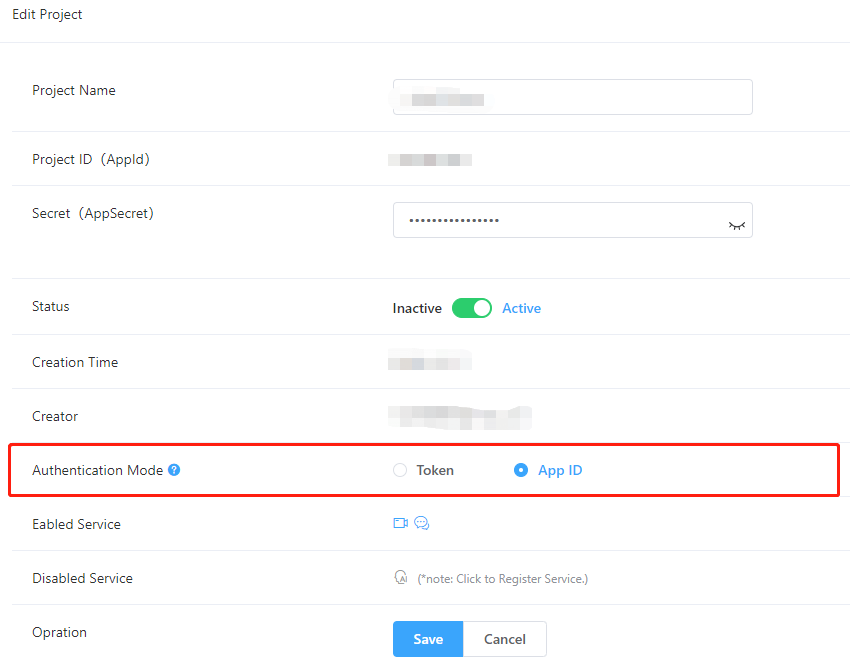

# MouseLive-Android
Solutions for Pan-Entertainment Scenarios [中文](./README_zh.md)

# Overview 
The solution is designed for Video Live Streaming and Audio Chat. You can use Thunder SDK, Hummer SDK and Beauty SDK to implement the functions below in your project.
- Video Live Streaming：including live broadcasting, multiplayer online viewing, multi-person text chat, video linking, mute, video beauty, video filter, video sticker, gesture display, etc.
- Audio Chat: including multi-person voice chat, multi-person text chat, voice change, becoming an anchor, people kicking, etc.

> Note：
>
> - Thunderbolt SDK: Mainly refers to control of audio and video. [Quick Integration](https://docs.aivacom.com/cloud/en/product_category/rtc_service/rt_video_interaction/integration_and_start/integration_and_start_android.html).
> - Hummer SDK: Mainly refers to the notification of user entering/exiting a room and the transmission of room messages. [Quick Integration](https://docs.aivacom.com/cloud/en/product_category/rtm_service/chatroom/integration_and_start/integration_and_start_android.html).
> - Beauty SDK: See details in [README](./effect/README.md).

# Integrate SDK
1. Go to [Jocloud](https://www.jocloud.com/en/reg) to register an account and create your own project to get the AppID.
2. Add the following line in **allprojects-repositories** under **build.gradle** file in your project.
    ```
    maven {url "http://nexus.jocloud.com:8081/nexus/content/groups/public/"}
    ```

3. Import Thunderbolt and Hummer SDK packages.
    Add the following line in **dependencies** under **build.gradle** file of the corresponding Module.
    ```
    //Thunderbolt
    implementation "com.rtc.thunder:thunderbolt:${thunder_version}"

    //Hummer
    implementation "com.hummer.im:core:${hummer_version}"
    implementation "com.hummer.im:chatroom:${hummer_version}"
    ```
    SDK version

    |SDK|Version|
    |:----|:----|
    |Thunderbolt|2.8.2|
    |Hummer|2.6.109|

4. Set the code 'com.sclouds.mouselive.Consts' with corresponding values.

> Note:
>
> **App ID** mode: Thunderbolt and Hummer SDK will skip the token verification, which is applicable to situations with low security requirements.
>
> **Token** mode: Thunderbolt and Hummer SDK will verify the token and the APP_SECRET is required. If the authentication expires or fails, the service is invalid. This mode is applicable to situations with high security requirements.
>- You can configure the AppID/Token mode in [Console](https://console.aivacom.com/#/manager/dashboard).

>- Please ensure that Appid is configured in the project path 'com.sclouds.mouselive.Consts'.
>- If it is Token mode, be sure to fill in the **APP_SECRET** value. If it is AppId mode, you can not fill in the **APP_SECRET** value.

# API Calling Flow
#### Thunderbolt Sequence Diagram


#### Hummer Sequence Diagram


### Video Live Streaming
- Main APIs

|API|Description|
|:----|:----|
|[createEngine](https://docs.aivacom.com/cloud/en/product_category/rtc_service/rt_video_interaction/api/Android/v2.8.0/function.html#thunderenginecreateengine)|Initialization (one process can only instantiate one)|
|[setArea](https://docs.aivacom.com/cloud/en/product_category/rtc_service/rt_video_interaction/api/Android/v2.8.0/function.html#thunderenginesetarea)|Set country/region|
|[setMediaMode](https://docs.aivacom.com/cloud/en/product_category/rtc_service/rt_video_interaction/api/Android/v2.8.0/function.html#thunderenginesetmediamode)|Set media mode|
|[setRoomMode](https://docs.aivacom.com/cloud/en/product_category/rtc_service/rt_video_interaction/api/Android/v2.8.0/function.html#thunderenginesetroommode)|Set room mode|
|[setAudioConfig](https://docs.aivacom.com/cloud/en/product_category/rtc_service/rt_video_interaction/api/Android/v2.8.0/function.html#thunderenginesetaudioconfig)|Set audio mode|
|[setAudioSourceType](https://docs.aivacom.com/cloud/en/product_category/rtc_service/rt_video_interaction/api/Android/v2.8.0/function.html#thunderenginesetaudiosourcetype)|Set audio publishing mode|
|[setVideoEncoderConfig](https://docs.aivacom.com/cloud/en/product_category/rtc_service/rt_video_interaction/api/Android/v2.8.0/function.html#thunderenginesetvideoencoderconfig)|Set video encoding parameters|
|[joinRoom](https://docs.aivacom.com/cloud/en/product_category/rtc_service/rt_video_interaction/api/Android/v2.8.0/function.html#thunderenginejoinroom)|Join a room, it is an asynchronous API and [onJoinRoomSuccess](https://docs.aivacom.com/cloud/en/product_category/rtc_service/rt_video_interaction/api/Android/v2.8.0/notification.html#thundereventhandleronjoinroomsuccess) should be listened to|
|[stopLocalAudioStream](https://docs.aivacom.com/cloud/en/product_category/rtc_service/rt_video_interaction/api/Android/v2.8.0/function.html#thunderenginestoplocalaudiostream)|Audio publish (disable Mic)|
|[startVideoPreview](https://docs.aivacom.com/cloud/en/product_category/rtc_service/rt_video_interaction/api/Android/v2.8.0/function.html#thunderenginestartvideopreview)|Enable local video preview|
|[stopLocalVideoStream](https://docs.aivacom.com/cloud/en/product_category/rtc_service/rt_video_interaction/api/Android/v2.8.0/function.html#thunderenginestoplocalvideostream)|Stop/resume sending local video streams|
|[setLocalVideoCanvas](https://docs.aivacom.com/cloud/en/product_category/rtc_service/rt_video_interaction/api/Android/v2.8.0/function.html#thunderenginesetlocalvideocanvas)|Set the local video render view|
|[setRemoteVideoCanvas](https://docs.aivacom.com/cloud/en/product_category/rtc_service/rt_video_interaction/api/Android/v2.8.0/function.html#thunderenginesetremotevideocanvas)|Set the remote video rendering view to view the image of the subscribed remote user|
|[addSubscribe](https://docs.aivacom.com/cloud/en/product_category/rtc_service/rt_video_interaction/api/Android/v2.8.0/function.html#thunderengineaddsubscribe)|Subscribe to a specific user’s streams across rooms|
|[removeSubscribe](https://docs.aivacom.com/cloud/en/product_category/rtc_service/rt_video_interaction/api/Android/v2.8.0/function.html#thunderengineremovesubscribe)|Cancel cross-room subscription|
|[switchFrontCamera](https://docs.aivacom.com/cloud/en/product_category/rtc_service/rt_video_interaction/api/Android/v2.8.0/function.html#thunderengineswitchfrontcamera)|To switch to the front/rear camera, [startVideoPreview](https://docs.aivacom.com/cloud/en/product_category/rtc_service/rt_video_interaction/api/Android/v2.8.0/function.html#thunderenginestartvideopreview) needs to be called after preview is turned on, and the front camera is used by default|
|[setLocalVideoMirrorMode](https://docs.aivacom.com/cloud/en/product_category/rtc_service/rt_video_interaction/api/Android/v2.8.0/function.html#thunderenginesetlocalvideomirrormode)|Set the local video mirroring mode, which only works for the front camera; by default, the rear camera cannot be mirrored when previewing or streaming, and for the front-facing camera, it is mirrored when previewing and not mirrored when streaming|
|[setEnableInEarMonitor](https://docs.aivacom.com/cloud/en/product_category/rtc_service/rt_video_interaction/api/Android/v2.8.0/function.html#thunderenginesetenableinearmonitor)|Enable/disable ear monitoring|
|[setVoiceChanger](https://docs.aivacom.com/cloud/en/product_category/rtc_service/rt_video_interaction/api/Android/v2.8.0/function.html#thunderenginesetvoicechanger)|Set voice change mode|
|[leaveRoom](https://docs.aivacom.com/cloud/en/product_category/rtc_service/rt_video_interaction/api/Android/v2.8.0/function.html#thunderengineleaveroom)|Exit a room, it is an asynchronous API and [onLeaveRoom](https://docs.aivacom.com/cloud/en/product_category/rtc_service/rt_video_interaction/api/Android/v2.8.0/notification.html#thundereventhandleronleaveroom) should be listened to|
|[destroyEngine](https://docs.aivacom.com/cloud/en/product_category/rtc_service/rt_video_interaction/api/Android/v2.8.0/function.html#thunderenginedestroyengine) |Destroy object|

#### Sequence Diagram


### Audio Room
- Main APIs

|API|Description|
|:----|:----|
|[createEngine](https://docs.aivacom.com/cloud/en/product_category/rtc_service/rt_video_interaction/api/Android/v2.8.0/function.html#thunderenginecreateengine) |Initialization (one process can only instantiate one)|
|[setArea](https://docs.aivacom.com/cloud/en/product_category/rtc_service/rt_video_interaction/api/Android/v2.8.0/function.html#thunderenginesetarea)|Set country/region|
|[setMediaMode](https://docs.aivacom.com/cloud/en/product_category/rtc_service/rt_video_interaction/api/Android/v2.8.0/function.html#thunderenginesetmediamode)|Set media mode|
|[setRoomMode](https://docs.aivacom.com/cloud/en/product_category/rtc_service/rt_video_interaction/api/Android/v2.8.0/function.html#thunderenginesetroommode)|Set room mode|
|[setAudioConfig](https://docs.aivacom.com/cloud/en/product_category/rtc_service/rt_video_interaction/api/Android/v2.8.0/function.html#thunderenginesetaudioconfig)|Set audio mode|
|[setAudioSourceType](https://docs.aivacom.com/cloud/en/product_category/rtc_service/rt_video_interaction/api/Android/v2.8.0/function.html#thunderenginesetaudiosourcetype)|Set audio publishing mode|
|[joinRoom](https://docs.aivacom.com/cloud/en/product_category/rtc_service/rt_video_interaction/api/Android/v2.8.0/function.html#thunderenginejoinroom)|Join a room, it is an asynchronous API and [onJoinRoomSuccess](https://docs.aivacom.com/cloud/en/product_category/rtc_service/rt_video_interaction/api/Android/v2.8.0/notification.html#thundereventhandleronjoinroomsuccess) should be listened to|
|[stopLocalAudioStream](https://docs.aivacom.com/cloud/en/product_category/rtc_service/rt_video_interaction/api/Android/v2.8.0/function.html#thunderenginestoplocalaudiostream)|Audio publish (disable Mic)|
|[setEnableInEarMonitor](https://docs.aivacom.com/cloud/en/product_category/rtc_service/rt_video_interaction/api/Android/v2.8.0/function.html#thunderenginesetenableinearmonitor)|Enable/disable ear monitoring|
|[setVoiceChanger](https://docs.aivacom.com/cloud/en/product_category/rtc_service/rt_video_interaction/api/Android/v2.8.0/function.html#thunderenginesetvoicechanger)|Set voice change mode|
|[leaveRoom](https://docs.aivacom.com/cloud/en/product_category/rtc_service/rt_video_interaction/api/Android/v2.8.0/function.html#thunderengineleaveroom)|Exit a room, it is an asynchronous API and [onLeaveRoom](https://docs.aivacom.com/cloud/en/product_category/rtc_service/rt_video_interaction/api/Android/v2.8.0/notification.html#thundereventhandleronleaveroom) should be listened to|
|[destroyEngine](https://docs.aivacom.com/cloud/en/product_category/rtc_service/rt_video_interaction/api/Android/v2.8.0/function.html#thunderenginedestroyengine) |Destroy object|

- Audio Music play API-ThunderAudioFilePlayer

|API|Description|
|:----|:----|
|[createAudioFilePlayer](https://docs.aivacom.com/cloud/en/product_category/rtc_service/rt_video_interaction/api/Android/v2.8.0/function.html#thunderenginecreateaudiofileplayer)|Initialization|
|[enablePublish](https://docs.aivacom.com/cloud/en/product_category/rtc_service/rt_video_interaction/api/Android/v2.8.0/function.html#thunderaudiofileplayerenablepublish)|Whether to use the currently playing file as a live accompaniment|
|[enableVolumeIndication](https://docs.aivacom.com/cloud/en/product_category/rtc_service/rt_video_interaction/api/Android/v2.8.0/function.html#thunderaudiofileplayerenablevolumeindication)|Enable the callback of audio file playback volume|
|[setPlayerNotify](https://docs.aivacom.com/cloud/en/product_category/rtc_service/rt_video_interaction/api/Android/v2.8.0/function.html#thunderaudiofileplayersetplayernotify)|Set the callback of audio player|
|[open](https://docs.aivacom.com/cloud/en/product_category/rtc_service/rt_video_interaction/api/Android/v2.8.0/function.html#thunderaudiofileplayeropen)|Open the file to be played, supporting file formats: mp3, aac, wav. This interface is asynchronous operation, you need to set [setPlayerEventCallback](https://docs.aivacom.com/cloud/en/product_category/rtc_service/rt_audio_interaction/api/Android/v2.8.0/function.html#thunderaudiofileplayersetplayernotify) callback, and then Listen to [onAudioFileStateChange](https://docs.aivacom.com/cloud/en/product_category/rtc_service/rt_audio_interaction/api/Android/v2.8.0/notification.html#ithunderaudiofileplayereventcallbackonaudiofilestatechange), when the event is [AUDIO_PLAY_EVENT_OPEN](https://docs.aivacom.com/cloud/en/product_category/rtc_service/rt_audio_interaction/api/Android/v2.8.0/function.html#thunderrtcconstantthunderaudiofileplayerevent), errorCode is [AUDIO_PLAYER_STATUS_SUCCESS](https://docs.aivacom.com/cloud/en/product_category/rtc_service/rt_audio_interaction/api/Android/v2.8.0/function.html#thunderrtcconstantthunderaudiofileplayererrorcode) Only if the file is successfully opened|
|[getTotalPlayTimeMS](https://docs.aivacom.com/cloud/en/product_category/rtc_service/rt_video_interaction/api/Android/v2.8.0/function.html#thunderaudiofileplayergettotalplaytimems)|Get the total play time of files, you need to call the open interface first and listen to [onAudioFileStateChange](https://docs.aivacom.com/cloud/en/product_category/rtc_service/rt_audio_interaction/api/Android/v2.8.0/notification.html#ithunderaudiofileplayereventcallbackonaudiofilestatechange) callback, after successfully opening the file, go to use this interface to obtain data.|
|[setLooping](https://docs.aivacom.com/cloud/en/product_category/rtc_service/rt_video_interaction/api/Android/v2.8.0/function.html#thunderaudiofileplayersetlooping)|Sets times of loop playbacks|
|[play](https://docs.aivacom.com/cloud/en/product_category/rtc_service/rt_video_interaction/api/Android/v2.8.0/function.html#thunderaudiofileplayerplay)|Start playing|
|[resume](https://docs.aivacom.com/cloud/en/product_category/rtc_service/rt_video_interaction/api/Android/v2.8.0/function.html#thunderaudiofileplayerresume)|Resume playing|
|[pause](https://docs.aivacom.com/cloud/en/product_category/rtc_service/rt_video_interaction/api/Android/v2.8.0/function.html#thunderaudiofileplayerpause)|Pause playback|
|[stop](https://docs.aivacom.com/cloud/en/product_category/rtc_service/rt_video_interaction/api/Android/v2.8.0/function.html#thunderaudiofileplayerstop)|Stop play|
|[setPlayVolume](https://docs.aivacom.com/cloud/en/product_category/rtc_service/rt_video_interaction/api/Android/v2.8.0/function.html#thunderaudiofileplayersetplayvolume)|Set volume|

#### Sequence Diagram


# FAQ
### Q: Why can't I see other's video?
- Check if the AppID is correct.
- Check if the startVideoPreview and stopLocalVideoStream are correctly set.
- Check if setRemoteVideoCanvas is set and the other's uid is correct.
- Check the room number on both sides. If you subscribe across rooms (different room numbers), you need to use addSubscribe and set the uid of the other party correctly.

### Q: Why can't I hear the other's voice?
- Check if the AppID is correct.
- Check if the parameter "stop" of stopLocalAudioStream is correctly set.
- Check if other's mobile phone is mute.
- Check if the both sides have joined the same room.

### Q: Why can't I hear the background music?
- Check if the AppID is correct.
- Check if the parameter “stop” of stopLocalAudioStream is correctly set.
- Check if other's mobile phone is mute.
- Check if the both sides have joined the same room
- Check if the parameter "sourceType" of setAudioSourceType is set to THUNDER_PUBLISH_MODE_MIX.
- Check if the parameter "enable" of enablePublish is set to "true".

### Q: Why can't I receive the callback IThunderAudioFilePlayerEventCallback?
- Check if setPlayerEventCallback is set.
- Check if enableVolumeIndication is set.

### Q: Why can’t I join the room (joinRoom)?
- Check if the AppID is correct.
- Check the [error code](https://docs.aivacom.com/cloud/en/product_category/rtc_service/rt_audio_interaction/api/Android/v2.8.0/code.html) returned by joinRoom to see the cause.

### Q: Why is playing audio files not looping?
- Check if setLooping(-1) is called after the file is opened via onAudioFileStateChange.