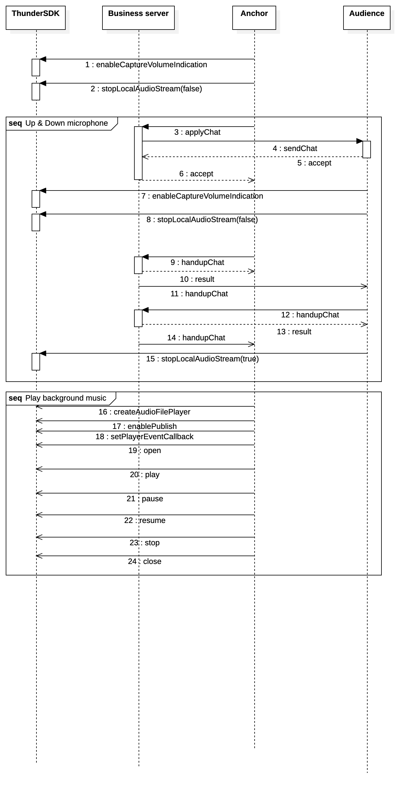

# MouseLive-Android
泛娱乐直播项目 [English](./README.md)

# 场景概述
泛娱乐包含2大模块：视频直播模块和语言聊天室模块。
- 视频直播模块：可实现直播开播、多人在线观看、多人文字聊天、视频连麦、禁言、视频美颜、视频滤镜、视频贴图、手势显示等功能。
- 语言聊天室模块：可实现多人语音聊天、多人文字聊天、变声、抢麦、踢人等功能。

> 说明
> - Thunderbolt SDK：主要对音视频的控制。[快速集成](https://docs.aivacom.com/cloud/cn/product_category/rtc_service/rt_video_interaction/integration_and_start/integration_and_start_android.html)
> - Hummer SDK：主要是对房间类用户进出通知，以及房间类消息的传输。[快速集成](https://docs.aivacom.com/cloud/cn/product_category/rtm_service/chatroom/integration_and_start/integration_and_start_android.html)
> - 美颜SDK：请看 effect 下[README](./effect/README.md) 文档

# 集成SDK
1. 去[聚联云平台](https://www.jocloud.com/cn/reg)注册账号，并创建自己的工程项目，获取到 AppID。
2. 添加maven地址。
    在工程父目录下找到build.gradle，然后在allprojects-repositories中增加以下代码。
    ```
    maven { url "http://nexus.jocloud.com:8081/nexus/content/groups/public/" }
    ```

3. 引入Thunder SDK 和 Hummer SDK 包。
在相应Module下找到build.gradle，在dependencies中增加以下代码。
    ```
    //Thunderbolt
    implementation "com.rtc.thunder:thunderbolt:${thunder_version}"

    //Hummer
    implementation "com.hummer.im:core:${hummer_version}"
    implementation "com.hummer.im:chatroom:${hummer_version}"
    ```
    相应SDK版本

    |SDK|版本|
    |:----|:----|
    |Thunderbolt|2.8.2|
    |Hummer|2.6.109|

4. 进入代码'com.sclouds.mouselive.Consts'下，配置相应值。

#### 说明:
**App ID** 模式：Thunderbolt和Hummer会跳过token验证。

**Token** 模式：适用于安全性要求较高的场景，Thunderbolt和Hummer会验证token，验证过期或者不通过则无法使用服务。
- 确保使用正确的鉴权模式 [后台配置](https://console.aivacom.com/#/manager/dashboard)。


- 确保工程路径'com.sclouds.mouselive.Consts'中进行配置AppID。
- 如果是Token模式，一定要填写**APP_SECRET**值。如果是AppID模式，可以不填写**APP_SECRET**值。

# API调用流程
#### Thunderbolt时序如下


#### Hummer时序如下


### 视频直播场景
- 视频功能-Thunderbolt主要API

|API|说明|
|:----|:----|
|[createEngine](https://docs.aivacom.com/cloud/cn/product_category/rtc_service/rt_video_interaction/api/Android/v2.8.0/function.html#thunderenginecreateengine) |初始化（一个进程只能实例化一个）|
|[setArea](https://docs.aivacom.com/cloud/cn/product_category/rtc_service/rt_video_interaction/api/Android/v2.8.0/function.html#thunderenginesetarea)|设置用户国家区域 |
|[setMediaMode](https://docs.aivacom.com/cloud/cn/product_category/rtc_service/rt_video_interaction/api/Android/v2.8.0/function.html#thunderenginesetmediamode)|配置媒体模式|
|[setRoomMode](https://docs.aivacom.com/cloud/cn/product_category/rtc_service/rt_video_interaction/api/Android/v2.8.0/function.html#thunderenginesetroommode)|配置房间模式|
|[setAudioConfig](https://docs.aivacom.com/cloud/cn/product_category/rtc_service/rt_video_interaction/api/Android/v2.8.0/function.html#thunderenginesetaudioconfig)|配置音频模式|
|[setAudioSourceType](https://docs.aivacom.com/cloud/cn/product_category/rtc_service/rt_video_interaction/api/Android/v2.8.0/function.html#thunderenginesetaudiosourcetype)|配置音频开播模式|
|[setVideoEncoderConfig](https://docs.aivacom.com/cloud/cn/product_category/rtc_service/rt_video_interaction/api/Android/v2.8.0/function.html#thunderenginesetvideoencoderconfig)|配置视频开播参数|
|[joinRoom](https://docs.aivacom.com/cloud/cn/product_category/rtc_service/rt_video_interaction/api/Android/v2.8.0/function.html#thunderenginejoinroom)|加入房间，此接口是异步接口，需要监控ThunderEventHandler中[onJoinRoomSuccess](https://docs.aivacom.com/cloud/cn/product_category/rtc_service/rt_video_interaction/api/Android/v2.8.0/notification.html#thundereventhandleronjoinroomsuccess)。|
|[stopLocalAudioStream](https://docs.aivacom.com/cloud/cn/product_category/rtc_service/rt_video_interaction/api/Android/v2.8.0/function.html#thunderenginestoplocalaudiostream)|音频推流开关（闭麦功能）|
|[startVideoPreview](https://docs.aivacom.com/cloud/cn/product_category/rtc_service/rt_video_interaction/api/Android/v2.8.0/function.html#thunderenginestartvideopreview)|本地视频预览开关|
|[stopLocalVideoStream](https://docs.aivacom.com/cloud/cn/product_category/rtc_service/rt_video_interaction/api/Android/v2.8.0/function.html#thunderenginestoplocalvideostream)|视频推流开关|
|[setLocalVideoCanvas](https://docs.aivacom.com/cloud/cn/product_category/rtc_service/rt_video_interaction/api/Android/v2.8.0/function.html#thunderenginesetlocalvideocanvas)|设置本地视图，设置此窗口，则可以看到我的视频画面|
|[setRemoteVideoCanvas](https://docs.aivacom.com/cloud/cn/product_category/rtc_service/rt_video_interaction/api/Android/v2.8.0/function.html#thunderenginesetremotevideocanvas)|设置远端视频的渲染视图，设置此窗口，则可以看到远端订阅的对应uid的流的画面|
|[addSubscribe](https://docs.aivacom.com/cloud/cn/product_category/rtc_service/rt_video_interaction/api/Android/v2.8.0/function.html#thunderengineaddsubscribe)|跨房间订阅（主播PK功能）|
|[removeSubscribe](https://docs.aivacom.com/cloud/cn/product_category/rtc_service/rt_video_interaction/api/Android/v2.8.0/function.html#thunderengineremovesubscribe)|取消跨房间订阅|
|[switchFrontCamera](https://docs.aivacom.com/cloud/cn/product_category/rtc_service/rt_video_interaction/api/Android/v2.8.0/function.html#thunderengineswitchfrontcamera)|切到前/后置摄像头，需要在开启预览后[startVideoPreview](https://docs.aivacom.com/cloud/cn/product_category/rtc_service/rt_video_interaction/api/Android/v2.8.0/function.html#thunderenginestartvideopreview)调用，默认使用前置摄像头|
|[setLocalVideoMirrorMode](https://docs.aivacom.com/cloud/cn/product_category/rtc_service/rt_video_interaction/api/Android/v2.8.0/function.html#thunderenginesetlocalvideomirrormode)|设置本地视频镜像模式，只对前置摄像头生效，后置摄像头不生效，后置摄像头固定预览推流都不镜像，前置摄像头默认预览镜像推流不镜像|
|[setEnableInEarMonitor](https://docs.aivacom.com/cloud/cn/product_category/rtc_service/rt_video_interaction/api/Android/v2.8.0/function.html#thunderenginesetenableinearmonitor)|打开/关闭耳返|
|[setVoiceChanger](https://docs.aivacom.com/cloud/cn/product_category/rtc_service/rt_video_interaction/api/Android/v2.8.0/function.html#thunderenginesetvoicechanger)|设置变声模式|
|[leaveRoom](https://docs.aivacom.com/cloud/cn/product_category/rtc_service/rt_video_interaction/api/Android/v2.8.0/function.html#thunderengineleaveroom)|离开房间，此接口是异步接口，需要监控ThunderEventHandler中[onLeaveRoom](https://docs.aivacom.com/cloud/cn/product_category/rtc_service/rt_video_interaction/api/Android/v2.8.0/notification.html#thundereventhandleronleaveroom)。|
|[destroyEngine](https://docs.aivacom.com/cloud/cn/product_category/rtc_service/rt_video_interaction/api/Android/v2.8.0/function.html#thunderenginedestroyengine) |销毁对象|

#### 时序图


### 语音聊天场景
- 音频功能-Thunderbolt主要API

|API|说明|
|:----|:----|
|[createEngine](https://docs.aivacom.com/cloud/cn/product_category/rtc_service/rt_video_interaction/api/Android/v2.8.0/function.html#thunderenginecreateengine) |初始化（一个进程只能实例化一个）|
|[setArea](https://docs.aivacom.com/cloud/cn/product_category/rtc_service/rt_video_interaction/api/Android/v2.8.0/function.html#thunderenginesetarea)|设置用户的国家/地区 |
|[setMediaMode](https://docs.aivacom.com/cloud/cn/product_category/rtc_service/rt_video_interaction/api/Android/v2.8.0/function.html#thunderenginesetmediamode)|配置媒体模式|
|[setRoomMode](https://docs.aivacom.com/cloud/cn/product_category/rtc_service/rt_video_interaction/api/Android/v2.8.0/function.html#thunderenginesetroommode)|配置房间模式|
|[setAudioConfig](https://docs.aivacom.com/cloud/cn/product_category/rtc_service/rt_video_interaction/api/Android/v2.8.0/function.html#thunderenginesetaudioconfig)|配置音频模式|
|[setAudioSourceType](https://docs.aivacom.com/cloud/cn/product_category/rtc_service/rt_video_interaction/api/Android/v2.8.0/function.html#thunderenginesetaudiosourcetype)|配置音频开播模式|
|[joinRoom](https://docs.aivacom.com/cloud/cn/product_category/rtc_service/rt_video_interaction/api/Android/v2.8.0/function.html#thunderenginejoinroom)|加入房间，此接口是异步接口，需要监控ThunderEventHandler中[onJoinRoomSuccess](https://docs.aivacom.com/cloud/cn/product_category/rtc_service/rt_video_interaction/api/Android/v2.8.0/notification.html#thundereventhandleronjoinroomsuccess)。|
|[stopLocalAudioStream](https://docs.aivacom.com/cloud/cn/product_category/rtc_service/rt_video_interaction/api/Android/v2.8.0/function.html#thunderenginestoplocalaudiostream)|音频推流开关（闭麦功能）|
|[setEnableInEarMonitor](https://docs.aivacom.com/cloud/cn/product_category/rtc_service/rt_video_interaction/api/Android/v2.8.0/function.html#thunderenginesetenableinearmonitor)|打开/关闭耳返|
|[setVoiceChanger](https://docs.aivacom.com/cloud/cn/product_category/rtc_service/rt_video_interaction/api/Android/v2.8.0/function.html#thunderenginesetvoicechanger)|设置变声模式|
|[leaveRoom](https://docs.aivacom.com/cloud/cn/product_category/rtc_service/rt_video_interaction/api/Android/v2.8.0/function.html#thunderengineleaveroom)|离开房间，此接口是异步接口，需要监控ThunderEventHandler中[onLeaveRoom](https://docs.aivacom.com/cloud/cn/product_category/rtc_service/rt_video_interaction/api/Android/v2.8.0/notification.html#thundereventhandleronleaveroom)。|
|[destroyEngine](https://docs.aivacom.com/cloud/cn/product_category/rtc_service/rt_video_interaction/api/Android/v2.8.0/function.html#thunderenginedestroyengine) |销毁对象|

- 音频音乐文件播放API-ThunderAudioFilePlayer

|API|说明|
|:----|:----|
|[createAudioFilePlayer](https://docs.aivacom.com/cloud/cn/product_category/rtc_service/rt_video_interaction/api/Android/v2.8.0/function.html#thunderenginecreateaudiofileplayer)|初始化|
|[enablePublish](https://docs.aivacom.com/cloud/cn/product_category/rtc_service/rt_video_interaction/api/Android/v2.8.0/function.html#thunderaudiofileplayerenablepublish)|配置是否将当前播放的文件作为直播伴奏使用|
|[enableVolumeIndication](https://docs.aivacom.com/cloud/cn/product_category/rtc_service/rt_video_interaction/api/Android/v2.8.0/function.html#thunderaudiofileplayerenablevolumeindication)|打开文件播放音量回调|
|[setPlayerNotify](https://docs.aivacom.com/cloud/cn/product_category/rtc_service/rt_video_interaction/api/Android/v2.8.0/function.html#thunderaudiofileplayersetplayernotify)|配置播放回调接口|
|[open](https://docs.aivacom.com/cloud/cn/product_category/rtc_service/rt_video_interaction/api/Android/v2.8.0/function.html#thunderaudiofileplayeropen)|打开需要播放的文件，支持文件格式：mp3、aac、wav。此接口是异步操作，需先设置[setPlayerEventCallback](https://docs.aivacom.com/cloud/cn/product_category/rtc_service/rt_audio_interaction/api/Android/v2.8.0/function.html#thunderaudiofileplayersetplayernotify)回调，然后监听[onAudioFileStateChange](https://docs.aivacom.com/cloud/cn/product_category/rtc_service/rt_audio_interaction/api/Android/v2.8.0/notification.html#ithunderaudiofileplayereventcallbackonaudiofilestatechange)，当event为[AUDIO_PLAY_EVENT_OPEN](https://docs.aivacom.com/cloud/cn/product_category/rtc_service/rt_audio_interaction/api/Android/v2.8.0/function.html#thunderrtcconstantthunderaudiofileplayerevent)，errorCode为[AUDIO_PLAYER_STATUS_SUCCESS](https://docs.aivacom.com/cloud/cn/product_category/rtc_service/rt_audio_interaction/api/Android/v2.8.0/function.html#thunderrtcconstantthunderaudiofileplayererrorcode)才算成功打开文件|
|[getTotalPlayTimeMS](https://docs.aivacom.com/cloud/cn/product_category/rtc_service/rt_video_interaction/api/Android/v2.8.0/function.html#thunderaudiofileplayergettotalplaytimems)|配置获取文件的总播放时长，需要先调用open接口，并且监听[onAudioFileStateChange](https://docs.aivacom.com/cloud/cn/product_category/rtc_service/rt_audio_interaction/api/Android/v2.8.0/notification.html#ithunderaudiofileplayereventcallbackonaudiofilestatechange)回调，成功打开文件之后，再去使用此接口获取数据。|
|[setLooping](https://docs.aivacom.com/cloud/cn/product_category/rtc_service/rt_video_interaction/api/Android/v2.8.0/function.html#thunderaudiofileplayersetlooping)|设置循环播放次数|
|[play](https://docs.aivacom.com/cloud/cn/product_category/rtc_service/rt_video_interaction/api/Android/v2.8.0/function.html#thunderaudiofileplayerplay)|开始播放|
|[resume](https://docs.aivacom.com/cloud/cn/product_category/rtc_service/rt_video_interaction/api/Android/v2.8.0/function.html#thunderaudiofileplayerresume)|继续播放|
|[pause](https://docs.aivacom.com/cloud/cn/product_category/rtc_service/rt_video_interaction/api/Android/v2.8.0/function.html#thunderaudiofileplayerpause)|暂停播放|
|[stop](https://docs.aivacom.com/cloud/cn/product_category/rtc_service/rt_video_interaction/api/Android/v2.8.0/function.html#thunderaudiofileplayerstop)|停止播放|
|[setPlayVolume](https://docs.aivacom.com/cloud/cn/product_category/rtc_service/rt_video_interaction/api/Android/v2.8.0/function.html#thunderaudiofileplayersetplayvolume)|设置音量|

#### 时序图


# 常见问题
### Q：为什么看不到对方视频？
- 检查AppID是否正确。
- 检查 startVideoPreview 和 stopLocalVideoStream 的值是否设置正确。
- 检查 setRemoteVideoCanvas是否设置，并且对方uid是否正确。
- 检查两边房间号，如果是跨房间订阅（不同房间号），需要使用 addSubscribe，并且正确的设置对方uid。

### Q：为什么听不到对方声音？
- 检查AppID是否正确。
- 确保已正确设置 stopLocalAudioStream 的参数stop。
- 检查自己手机是否为静音模式。
- 检查双方是否已成功加入同一个房间（joinRoom）。

### Q：为什么观众听不到房主播放的音频文件？
- 检查AppID是否正确。
- 确保已正确设置 stopLocalAudioStream 的参数stop。
- 检查对方手机音量，是否是静音模式。
- 检查双方是否已成功加入同一个房间（joinRoom）。
- 确保已将 setAudioSourceType 的参数 sourceType 设置为THUNDER_PUBLISH_MODE_MIX。
- 确保已将 enablePublish 参数 enable 设置为"true"。

### Q：为什么收不到IThunderAudioFilePlayerEventCallback回调
- 检查是否设置 setPlayerEventCallback。
- 检查是否设置 enableVolumeIndication。

### Q：为什么加入房间（joinRoom）失败？
- 检查AppID是否正确。
- 检查 joinRoom 返回的[错误码](https://docs.aivacom.com/cloud/cn/product_category/rtc_service/rt_audio_interaction/api/Android/v2.8.0/code.html)，查看具体原因。

### Q：为什么无法循环播放音频文件？
- 确保已调用setLooping(-1)（在回调onAudioFileStateChange成功打开文件之后调用）。