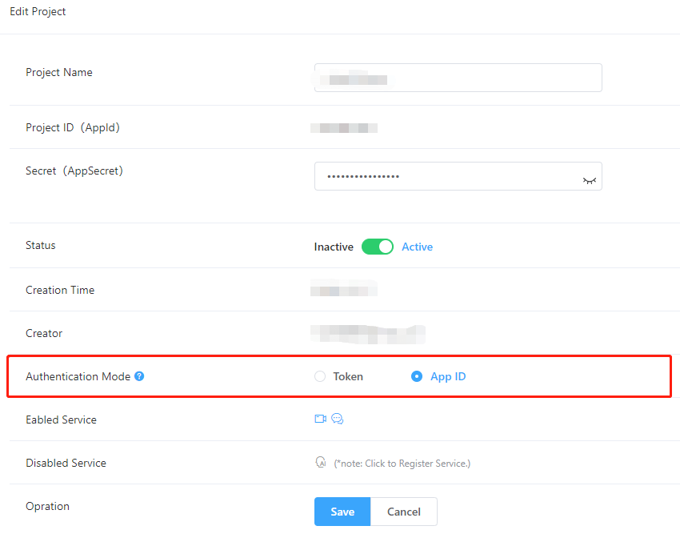

# MouseLive-IOS
Solutions for Pan-Entertainment Scenarios [中文](./README_zh.md)

# Overview 
The solution is designed for Video Live Streaming and Audio Chat. You can use Thunder SDK, Hummer SDK and Beauty SDK to implement the functions below in your project.
- Video Live Streaming：including live broadcasting, multiplayer online viewing, multi-person text chat, video linking, mute, video beauty, video filter, video sticker, gesture display, etc.
- Audio Chat: including multi-person voice chat, multi-person text chat, voice change, becoming an anchor, people kicking, etc.

> Note：
>
> - Thunderbolt SDK: Mainly refers to control of audio and video. [Quick Integration](https://docs.aivacom.com/cloud/en/product_category/rtc_service/rt_video_interaction/integration_and_start/integration_and_start_ios.html).
> - Hummer SDK: Mainly refers to the notification of user entering/exiting a room and the transmission of room messages. [Quick Integration](https://docs.aivacom.com/cloud/en/product_category/rtm_service/chatroom/integration_and_start/integration_and_start_ios.html).

# Integrated SDK
1. Go to [Jocloud](https://www.jocloud.com/en/reg) to register an account and create your own project to get the AppID.
2. Install CocoaPods. Enter the following command line in Terminal:
    ```sh
    brew install cocoapods
    ```
    If you have installed CocoaPods and Homebrew in your system, you can skip this step.
    If Terminal displays -bash: brew: command not found, you need to install Homebrew before entering the command line. For details, see [Document](https://brew.sh/index.html).
3. Create a Podfile.
    ```sh
    pod init
    ```
4. Add references to ThunderBolt SDK and Hummer SDK
Open the Podfile text file and modify the file to the following content. Note that "YourApp" is your Target name, you need to add the source and SDK versions.
    ```python
    # Uncomment the next line to define a global platform for your project
    platform :ios, '9.0'

    source'https://github.com/CocoaPods/Specs.git'#Add item
    source'https://github.com/yyqapm/specs.git'#Add item
    target'YourApp' do
    # Uncomment the next line if you're using Swift or would like to use dynamic frameworks
    # use_frameworks!

    # Pods for YourApp
    pod'Hummer/ChatRoom', '2.6.107' #Add item, '2.6.107' is the Hummer SDK version number, please modify according to the specific imported version number
    pod'thunder','2.7.0' #Add item, '2.7.0' is thunderbolt sdk version number, please modify according to the specific imported version number

    end
    ```

    SDK version

    |SDK|Version|
    |:----|:----|
    |Thunder|2.7.0|
    |Hummer|2.6.107|

5. Set the code 'MouseLive/Common/SYAppInfo.m' with corresponding values.

> Note:
>
> **App ID** mode: Hummer and Thunder SDK will skip the token verification, which is applicable to situations with low security requirements.
>
> **Token** mode: Hummer and Thunder SDK will verify the token and the APP_SECRET is required. If the authentication expires or fails, the service is invalid. This mode is applicable to situations with high security requirements.
>- You can configure the AppID/Token mode in [Console](https://console.aivacom.com/#/manager/dashboard).

>- Please ensure that Appid is configured in the project path 'MouseLive/Common/SYAppInfo.m'.
>- If it is Token mode, be sure to fill in the **APP_SECRET** value. If it is AppId mode, you can not fill in the **APP_SECRET** value.

# API Calling Flow
#### Thunderbolt Sequence Diagram


#### Hummer Sequence Diagram


### Video Live Streaming
- Main APIs

|API|Description|
|:----|:----|
| [createEngine](https://docs.aivacom.com/cloud/en/product_category/rtc_service/rt_video_interaction/api/iOS/v2.7.0/function.html#thunderenginecreateenginesceneiddelegate) | Initialization (one process can only instantiate one) |
| [setArea](https://docs.aivacom.com/cloud/en/product_category/rtc_service/rt_video_interaction/api/iOS/v2.7.0/function.html#thunderenginesetarea) | Set country/region|
| [setMediaMode](https://docs.aivacom.com/cloud/en/product_category/rtc_service/rt_video_interaction/api/iOS/v2.7.0/function.html#thunderenginesetmediamode) | Set media mode|
| [setRoomMode](https://docs.aivacom.com/cloud/en/product_category/rtc_service/rt_video_interaction/api/iOS/v2.7.0/function.html#thunderenginesetroommode) | Set room mode|
| [setAudioConfig](https://docs.aivacom.com/cloud/en/product_category/rtc_service/rt_video_interaction/api/iOS/v2.7.0/function.html#thunderenginesetaudioconfigcommutmodescenariomode) | Set audio mode |
| [setAudioSourceType](https://docs.aivacom.com/cloud/en/product_category/rtc_service/rt_video_interaction/api/iOS/v2.7.0/function.html#thunderenginesetaudiosourcetype) | Set audio publishing mode|
| [setVideoEncoderConfig](https://docs.aivacom.com/cloud/en/product_category/rtc_service/rt_video_interaction/api/iOS/v2.7.0/function.html#thunderenginesetvideoencoderconfig) | Set video encoding parameters|
| [joinRoom](https://docs.aivacom.com/cloud/en/product_category/rtc_service/rt_video_interaction/api/iOS/v2.7.0/function.html#thunderenginejoinroomroomnameuid) |Join a room, it is an asynchronous API and [onJoinRoomSuccess](https://docs.aivacom.com/cloud/en/product_category/rtc_service/rt_video_interaction/api/Android/v2.8.0/notification.html#thundereventhandleronjoinroomsuccess) should be listened to|
| [stopLocalAudioStream](https://docs.aivacom.com/cloud/en/product_category/rtc_service/rt_video_interaction/api/iOS/v2.7.0/function.html#thunderenginestoplocalaudiostream) |Audio publish (disable Mic)|
| [startVideoPreview](https://docs.aivacom.com/cloud/en/product_category/rtc_service/rt_video_interaction/api/iOS/v2.7.0/function.html#thunderenginestartvideopreview) | Enable local video preview|
| [stopLocalVideoStream](https://docs.aivacom.com/cloud/en/product_category/rtc_service/rt_video_interaction/api/iOS/v2.7.0/function.html#thunderenginestoplocalvideostream) |Stop/resume sending local video streams|
| [setLocalVideoCanvas](https://docs.aivacom.com/cloud/en/product_category/rtc_service/rt_video_interaction/api/iOS/v2.7.0/function.html#thunderenginesetlocalvideocanvas) | Set the local video render view|
| [setRemoteVideoCanvas](https://docs.aivacom.com/cloud/en/product_category/rtc_service/rt_video_interaction/api/iOS/v2.7.0/function.html#thunderenginesetremotevideocanvas) | Set the remote video rendering view to view the image of the subscribed remote user|
| [addSubscribe](https://docs.aivacom.com/cloud/en/product_category/rtc_service/rt_video_interaction/api/iOS/v2.7.0/function.html#thunderengineaddsubscribeuid) |Subscribe to a specific user’s streams across rooms|
| [removeSubscribe](https://docs.aivacom.com/cloud/en/product_category/rtc_service/rt_video_interaction/api/iOS/v2.7.0/function.html#thunderengineremovesubscribeuid) |Cancel cross-room subscription|
| [switchFrontCamera](https://docs.aivacom.com/cloud/en/product_category/rtc_service/rt_video_interaction/api/iOS/v2.7.0/function.html#thunderengineswitchfrontcamera) |To switch to the front/rear camera, [startVideoPreview](https://docs.aivacom.com/cloud/en/product_category/rtc_service/rt_video_interaction/api/Android/v2.8.0/function.html#thunderenginestartvideopreview) needs to be called after preview is turned on, and the front camera is used by default|
| [setLocalVideoMirrorMode](https://docs.aivacom.com/cloud/en/product_category/rtc_service/rt_video_interaction/api/iOS/v2.7.0/function.html#thunderenginesetlocalvideomirrormode) | Set the local video mirroring mode, which only works for the front camera; by default, the rear camera cannot be mirrored when previewing or streaming, and for the front-facing camera, it is mirrored when previewing and not mirrored when streaming|
| [setEnableInEarMonitor](https://docs.aivacom.com/cloud/en/product_category/rtc_service/rt_video_interaction/api/iOS/v2.7.0/function.html#thunderenginesetenableinearmonitor) | Enable/disable ear monitoring|
| [setVoiceChanger](https://docs.aivacom.com/cloud/en/product_category/rtc_service/rt_video_interaction/api/iOS/v2.7.0/function.html#thunderenginesetvoicechanger)| Set voice change mode              |
| [leaveRoom](https://docs.aivacom.com/cloud/en/product_category/rtc_service/rt_video_interaction/api/iOS/v2.7.0/function.html#thunderengineleaveroom) |Exit a room, it is an asynchronous API and [onLeaveRoomWithStats](https://docs.aivacom.com/cloud/en/product_category/rtc_service/rt_video_interaction/api/iOS/v2.7.0/notification.html#thundereventdelegatethunderengineonleaveroomwithstats) should be listened to|

#### Sequence Diagram


### Chat Room
- Main APIs

|API|Description|
|:----|:----|
| [createEngine](https://docs.aivacom.com/cloud/en/product_category/rtc_service/rt_video_interaction/api/iOS/v2.7.0/function.html#thunderenginecreateenginesceneiddelegate) | Initialization (one process can only instantiate one) |
| [setArea](https://docs.aivacom.com/cloud/en/product_category/rtc_service/rt_video_interaction/api/iOS/v2.7.0/function.html#thunderenginesetarea) | Set region |
| [setMediaMode](https://docs.aivacom.com/cloud/en/product_category/rtc_service/rt_video_interaction/api/iOS/v2.7.0/function.html#thunderenginesetmediamode) | Set Media Mode |
| [setRoomMode](https://docs.aivacom.com/cloud/en/product_category/rtc_service/rt_video_interaction/api/iOS/v2.7.0/function.html#thunderenginesetroommode) | Set Room mode |
| [setAudioConfig](https://docs.aivacom.com/cloud/en/product_category/rtc_service/rt_video_interaction/api/iOS/v2.7.0/function.html#thunderenginesetaudioconfigcommutmodescenariomode) | Set Audio mode |
| [setAudioSourceType](https://docs.aivacom.com/cloud/en/product_category/rtc_service/rt_video_interaction/api/iOS/v2.7.0/function.html#thunderenginesetaudiosourcetype) | Set Audio broadcast mode |
| [joinRoom](https://docs.aivacom.com/cloud/en/product_category/rtc_service/rt_video_interaction/api/iOS/v2.7.0/function.html#thunderenginejoinroomroomnameuid) | Join the room, this interface is asynchronous interface, need to monitor ThunderEventHandler [onJoinRoomSuccess](https://docs.aivacom.com/cloud/en/product_category/rtc_service/rt_video_interaction/api/iOS/v2.7.0/notification.html#thundereventdelegatethunderengineonjoinroomsuccesswithuidelapsed)。 |
| [stopLocalAudioStream](https://docs.aivacom.com/cloud/en/product_category/rtc_service/rt_video_interaction/api/iOS/v2.7.0/function.html#thunderenginestoplocalaudiostream) | Audio push switch (close wheat function) |
| [setEnableInEarMonitor](https://docs.aivacom.com/cloud/en/product_category/rtc_service/rt_video_interaction/api/iOS/v2.7.0/function.html#thunderenginesetenableinearmonitor) | Enable/disable ear monitoring |
| [setVoiceChanger](https://docs.aivacom.com/cloud/en/product_category/rtc_service/rt_video_interaction/api/iOS/v2.7.0/function.html#thunderenginesetvoicechanger) | Set voice change mode |
| [leaveRoom](https://docs.aivacom.com/cloud/en/product_category/rtc_service/rt_video_interaction/api/iOS/v2.7.0/function.html#thunderengineleaveroom) | Exit a room, it is an asynchronous API and [onLeaveRoomWithStats](https://docs.aivacom.com/cloud/en/product_category/rtc_service/rt_video_interaction/api/iOS/v2.7.0/notification.html#thundereventdelegatethunderengineonleaveroomwithstats) should be listened to|

- Audio Music play API-ThunderAudioFilePlayer

|API|Description|
|:----|:----|
| [createAudioFilePlayer](https://docs.aivacom.com/cloud/en/product_category/rtc_service/rt_video_interaction/api/iOS/v2.7.0/function.html#thunderenginecreateaudiofileplayer) | Initialization                                         |
| [enablePublish](https://docs.aivacom.com/cloud/en/product_category/rtc_service/rt_video_interaction/api/iOS/v2.7.0/function.html#thunderaudiofileplayerenablepublish)  | Set Whether to use the currently playing file as a live accompaniment |
| [enableVolumeIndication](https://docs.aivacom.com/cloud/en/product_category/rtc_service/rt_video_interaction/api/iOS/v2.7.0/function.html#thunderaudiofileplayerenablevolumeindicationinterval) | Set open file playback volume callback |
| [onAudioFilePlaying](https://docs.aivacom.com/cloud/en/product_category/rtc_service/rt_video_interaction/api/iOS/v2.7.0/notification.html#thunderaudiofileplayerdelegateonaudiofileplaying) | Set playback callback interface   |
| [open](https://docs.aivacom.com/cloud/en/product_category/rtc_service/rt_video_interaction/api/iOS/v2.7.0/function.html#thunderaudiofileplayeropen)  | Open the file to be played, supporting file formats: mp3, aac, wav. This interface is an asynchronous operation, you need to set [setPlayerDelegate](https://docs.aivacom.com/cloud/en/product_category/rtc_service/rt_audio_interaction/api/iOS/v2.8.0/function.html#thunderaudiofileplayersetplayerdelegate) callback first, and then Listen [onAudioFileStateChange](https://docs.aivacom.com/cloud/en/product_category/rtc_service/rt_audio_interaction/api/iOS/v2.8.0/notification.html#thunderaudiofileplayerdelegateonaudiofilestatechangeeventerrorcode), when the event is [AUDIO_PLAY_EVENT_OPEN](https://docs.aivacom.com/cloud/en/product_category/rtc_service/rt_audio_interaction/api/iOS/v2.8.0/notification.html#thunderaudiofileplayerevent), errorCode is [AUDIO_PLAYER_STATUS_SUCCESS](https://docs.aivacom.com/cloud/en/product_category/rtc_service/rt_audio_interaction/api/iOS/v2.8.0/notification.html#thunderaudiofileplayererrorcode) Only if the file is successfully opened|
| [getTotalPlayTimeMS](https://docs.aivacom.com/cloud/en/product_category/rtc_service/rt_video_interaction/api/iOS/v2.7.0/function.html#thunderaudiofileplayergettotalplaytimems)  |To get the total playing time of the file, you need to call the open interface first and listen to [onAudioFileStateChange](https://docs.aivacom.com/cloud/en/product_category/rtc_service/rt_audio_interaction/api/Android/v2.8.0/notification.html#ithunderaudiofileplayereventcallbackonaudiofilestatechange) callback, after successfully opening the file, go to use this interface to obtain data.|
| [setLooping](https://docs.aivacom.com/cloud/en/product_category/rtc_service/rt_video_interaction/api/iOS/v2.7.0/function.html#thunderaudiofileplayersetlooping) | Set Set the number of loops   |
| [play](https://docs.aivacom.com/cloud/en/product_category/rtc_service/rt_video_interaction/api/iOS/v2.7.0/function.html#thunderaudiofileplayerplay)  | Start playing                          |
| [resume](https://docs.aivacom.com/cloud/en/product_category/rtc_service/rt_video_interaction/api/iOS/v2.7.0/function.html#thunderaudiofileplayerresume)| Resume playing                         |
| [pause](https://docs.aivacom.com/cloud/en/product_category/rtc_service/rt_video_interaction/api/iOS/v2.7.0/function.html#thunderaudiofileplayerpause) | Pause playback                         |
| [stop](https://docs.aivacom.com/cloud/en/product_category/rtc_service/rt_video_interaction/api/iOS/v2.7.0/function.html#thunderaudiofileplayerstop) | Stop play                              |
| [setPlayVolume](https://docs.aivacom.com/cloud/en/product_category/rtc_service/rt_video_interaction/api/iOS/v2.7.0/function.html#thunderaudiofileplayersetplayvolume)  | Set volume |

#### Sequence Diagram


# FAQ
### Q: Why can't I see other's video?
- Check if the AppID is correct.
- Check if the startVideoPreview and stopLocalVideoStream are correctly set.
- Check if setRemoteVideoCanvas is set and the other's uid is correct.
- Check the room number on both sides. If you subscribe across rooms (different room numbers), you need to use addSubscribe and set the uid of the other party correctly.

### Q: Why can't I hear the other's voice?
- Check if the AppID is correct.
- Check if the parameter "stop" of stopLocalAudioStream is correctly set.
- Check if other's mobile phone is mute.
- Check if the both sides have joined the same room.

### Q: Why can't I hear the background music?
- Check if the AppID is correct.
- Check if the parameter “stop” of stopLocalAudioStream is correctly set.
- Check if other's mobile phone is mute.
- Check if the both sides have joined the same room
- Check if the parameter "sourceType" of setAudioSourceType is set to THUNDER_PUBLISH_MODE_MIX.
- Check if the parameter "enable" of enablePublish is set to "true".

### Q: Why can't I receive the callback ThunderAudioFilePlayerDelegate?
- Check if setPlayerDelegate is set.
- Check if enableVolumeIndication is set.

### Q: Why can’t I join the room (joinRoom)?
- Check if the AppID is correct.
- Check the [error code](https://docs.aivacom.com/cloud/en/product_category/rtc_service/rt_audio_interaction/api/iOS/v2.8.0/code.html) returned by joinRoom to see the cause.

### Q: Why is playing audio files not looping?
- Check if setLooping(-1) is called after the file is opened via onAudioFileStateChange.
